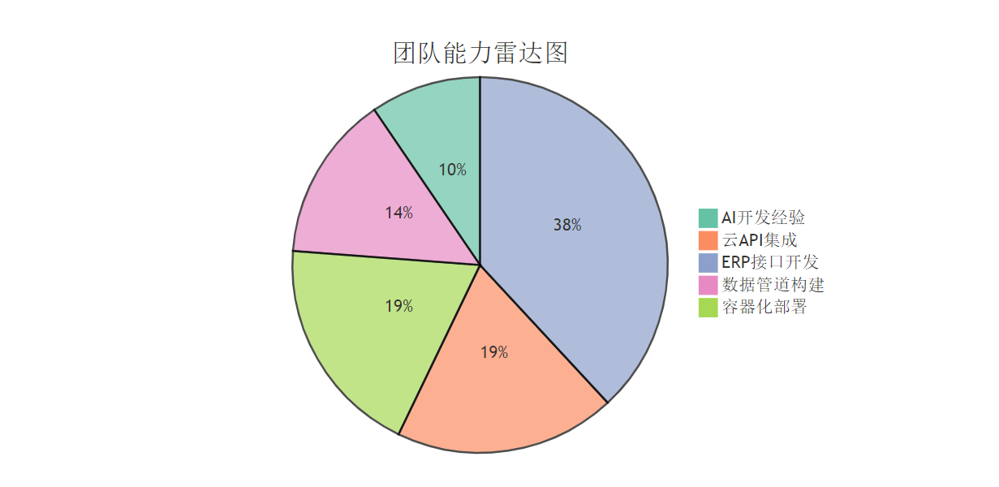

# 没有AI背景的团队如何快速进行AI开发

我们公司跨境电商ERP，大家其实都没有AI背景，但是随着各种AI应用开发的工具不断普及，大模型能力的不断加强，我们发现AI开发其实不需要我们有AI背景，我们只需要去使用大模型，接下大模型开发即可。这不需要你有高深的AI基础，更多需要你对业务方面的洞察。

***

#### 1. 团队现状分析 

<figure><figcaption></figcaption></figure>

* 优势
* 微服务架构和API接口经验丰富（快速集成AI服务）
* 运维熟悉Docker（模型服务化部署无障碍）
* 团队中有部分AI基础（协调技术选型）
* 短板
* 缺乏AI项目全流程经验（数据收集→训练→部署→监控）
* 无现成训练数据（需从ERP系统逆向构建数据集）
* Python团队需突击学习AI开发框架

***

#### 2. 需要准备的核心能力 

**技术能力**

| 能力项                   | 获取方式                      | 时间预算 |
| --------------------- | ------------------------- | ---- |
| LLM API调用（Python）     | 文档学习+沙箱测试                 | 1天   |
| 数据清洗（Pandas,大数据相关的工具） | 实战中学习（MVP阶段简单数据处理）        | 3天   |
| 模型服务化（Flask）          | 搭建Demo接口                  | 1天   |
| Agent 工作流配置 （mvp）     | dify,coze（MVP阶段快速实现agent） | 2天   |
| Langchain (代码搭建agent) | 官网                        | 3天   |

**业务能力**

* AI+ERP 是用新工具对老业务提效，因此我们必须懂业务才能切入到老业务的痛点
* AI给之前老技术实现不了的技术通过了可能，因此 原有的业务实现思路我们可以进行革新
* AI技术会淘汰一些工具属性的工作，更多会需要管理AI的业务能力

**工程能力**

* 接口规范：明确ERP→AI服务的数据格式（JSON样例）
* agent工具流: 和业务人员将需求转化为工作流，将工作流集成到erp中
* 版本控制：建立AI模型版本与ERP版本的映射关系（如：v1.2-ERP对应v0.1-AI）
* 监控指标：定义API响应时间、准确率等SLA（后续扩展用）

***

#### 3. 第一个任务启动步骤 

**任务选择2：智能客服（云API集成）**

* Day 1
* 获取 LLM API账号(openai/通义/deepseek...)，测试api，国内基本都有测试token，简单项目用个一两个月都没问题
* 运维搭建dify，可以直接先docker快速搭建
* Day 2-8
* 在ERP中新增/ai/chat接口路由
* 使用 dify 实现agent 前期可以通过知识库（RAG）简单实现
* 集成 mcp/function call (可以通过agent组件实现)获取一些业务数据，如订单/库存
* 用现成组件（如ChatUI）搭建对话界面
* Day 8-14
* 联调测试：模拟用户咨询订单状态
* 埋点：记录用户问题类型（为后续优化积累数据）

***

#### 4. 分阶段计划 

**Phase 1：MVP验证（1-2个月）**

| 周次  | 目标           | 交付物            |
| --- | ------------ | -------------- |
| 1-2 | 智能客服云API对接   | 可回答订单状态的对话机器人  |
| 3-4 | Listing关键词提取 | 商品页展示TOP5优化关键词 |
| 5-8 | 异常检测规则引擎     | 每日销售波动报警邮件     |

**Phase 2：能力建设（3-6个月）**

* 数据工程：搭建MySQL→MinIO→Python数据管道（这一块是大数据相关的能力）
* 模型微调：用历史数据微调预测模型 (微调前期可以借助各种厂商的进行测试)
* 替换云API：使用自己的微调模型（需标注500+客服对话记录）(如需要)

**Phase 3：深度集成（7-12个月）**

* 实现AI驱动自动化：
* 广告出价调整（根据预测CTR）
* 动态库存预警（结合供应链数据）

***

#### 关键风险控制表 

| 风险点           | 缓解措施                               | 负责人      |
| ------------- | ---------------------------------- | -------- |
| 云API响应延迟      | 本地缓存高频问答                           | 运维工程师    |
| 数据标注质量差       | 采购第三方标注服务（如Amazon Mechanical Turk） | 技术经理     |
| 模型效果不达标       | 保留规则引擎作为备用逻辑                       | Python团队 |
| 云api token消耗大 | 1.优化提示词+工作流 2.本地搭建替代               | Python团队 |

***

#### 立即行动清单 

1. 项目成员目标对齐，技术栈学习 prompt工程，dify使用，python, langchain，MCP
2. 搭建本地dify（快速验证mvp）
3. 梳理当前可以实现的工作流，提取出一到两个需要快速出demo，先实现简单的建立信心
4. 爬虫开放api,供agents使用 (数据)

### 总结： 

作为一个传统的跨境电商公司小公司，我们公司erp中属于传统的老项目了，php，java都有用到，我们团队都没有ai开发的背景（可能有点，就是用ai写代码\[dogo]）.业务人员有使用但是也只是在web页面使用如chatgpt，deepseek等ai工具。但是用过ai工具的人都会发现ai确实可以给我带来2倍效率的提速，熟练使用甚至可以到10倍以上，如果你是高级用户在学会点高级ai工具 (claude code + mcp + 各种agent),可能10倍都不止。ai的接入可以一定程度生将需要人脑判断分析的工作给接过来。

传统erp接入AI这是个大市场，而且随着现在ai工具和大模型能力/价格方面都在不断优化。传统erp接入AI其实人人都可以做，甚至你都可以不用是专业开发。**在对大模型能力的深度理解基础上，抓住实际场景，把它的能力用起来，我相信一定对你的业务有所帮助**。
