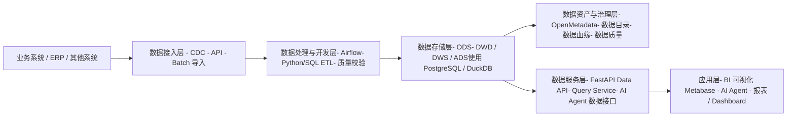
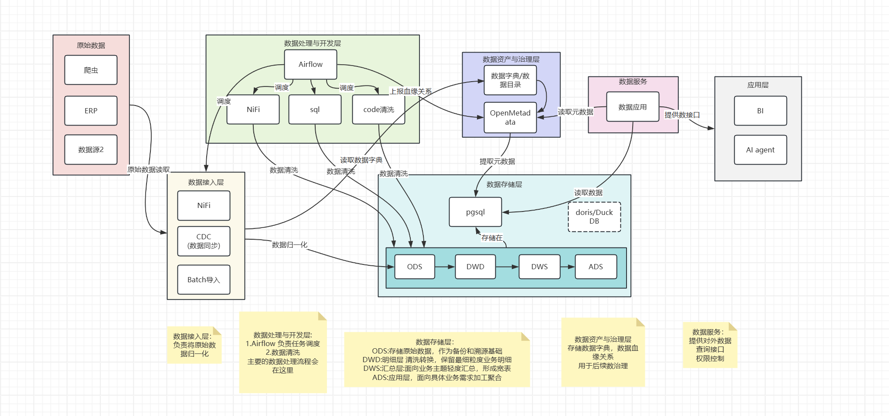
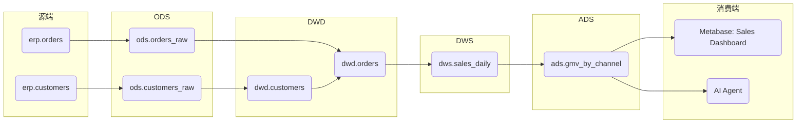

# 数据中台技术架构文档（中小型跨境电商企业·轻量级方案）

### 1. 项目背景与建设目标

#### **1.1 公司背景**

公司属于 **中小型电商 / 跨境电商企业**，业务涉及多站点、多平台、多仓、多渠道运营，系统生态以 ERP 为中心。

#### **1.2 数据现状与痛点**

当前数据主要存储在 ERP 系统中，存在以下问题：

* 数据分散、标准不统一
* 业务系统间缺乏协同，形成数据孤岛
* 数据质量不稳定（口径不统一、重复、缺失）
* 决策依赖人工导数，效率低
* 无法有效支持 AI Agent 快速读取、理解和调用数据
* 缺乏数据血缘，难以追踪数据来源与去向

#### **1.3 建设目标**

建设一个 **轻量级数据中台**，满足：

* ⭐ **统一数据标准与数据资产管理**
* ⭐ **稳定的数据质量规则与校验机制**
* ⭐ **可解释性（数据血缘）、数据可追踪性**
* ⭐ **支持数据共享与跨团队协作**
* ⭐ **为业务分析与 AI Agent 提供实时/准实时的数据服务能力**
* ⭐ **低成本、开源、易部署、易维护**

***

### 2. 数据中台总体架构（轻量级）



**设计特点：**

* 使用开源、轻量、可本地部署的组件
* 优先选择“易用”而不是复杂大规模产品
* 每层组件均可随着业务成长逐步升级

<figure><figcaption></figcaption></figure>

### 3. 各模块设计说明

#### **3.1 数据接入层（Ingestion）**

轻量级数据接入，可采用：

* **API Pull**（ERP → 中台）
* **Python 脚本定时拉取**
* **DB CDC**（MySQL/PostgreSQL → 中台）

主要技术：

* Airflow + Python Operator
* Simple CDC（基于更新时间、流水号）

#### **3.2 数据处理与开发层（ETL/ELT）**

基于团队现有能力（Python / SQL / Java / Go），使用：

* **Airflow** 调度数据任务
* ETL 逻辑：Python + SQL 混合
* DuckDB 或 PostgreSQL 做轻量加工

特性：

* 按数据分层标准构建（ODS → DWD → DWS → ADS）
* 支持数据质量规则（唯一性、完整性、业务口径规则）

#### **3.3 数据存储层（Data Storage）**

中小企业不需要大规模数仓，可采用：

* **PostgreSQL**（关系型数仓）
* **DuckDB**（本地列存、适合 AI Embedding 预处理）

分层：

* ODS：原始数据
* DWD：清洗后明细
* DWS：宽表 / 汇总层
* ADS：面向业务的指标输出

#### **3.4 数据资产与治理层**

推荐使用 **OpenMetadata（轻量可部署，社区活跃）**。

能力包含：

* 表级、字段级 **数据血缘**
* 数据目录
* 元数据管理
* 数据质量校验集成
* 与 Airflow/SQLAlchemy/PostgreSQL 原生兼容

血缘能力：

* 自动生成 ETL 血缘
* 支持 SQL 解析
* Airflow 任务自动汇报 lineage

#### **3.5 数据服务层（Data API / AI Service）**

使用 FastAPI + PostgreSQL 组合构建 API 层：

* **统一查询 API**
* AI Agent 数据接口（结构化 Query → SQL → 结果返回）
* 缓存：Redis（可选）

对 AI Agent 提供：

* 数据 Schema 注册
* 语义字段说明
* 自动数据口径对齐能力

#### **3.6 应用层**

* **BI**：Metabase（开源、低成本）
* **AI Agent**：直接读取 Data API
* **业务运营报表**：定制 API + Metabase

***

### 4. 推荐的技术栈（轻量开源、易部署）

#### **4.1 数据接入**

| 功能     | 技术      | 理由                |
| ------ | ------- | ----------------- |
| 调度     | Airflow | 开源、插件丰富、架构轻量      |
| 脚本开发   | Python  | ETL 主力语言、生态完善     |
| API 接入 | FastAPI | 高性能、易扩展、Python 生态 |

#### **4.2 数据处理 / 数仓**

| 功能   | 技术           | 理由           |
| ---- | ------------ | ------------ |
| 处理引擎 | Python + SQL | 成本低，团队易掌握    |
| 数仓   | PostgreSQL   | 开源、稳定、功能全面   |
| 列存计算 | Doris        | AI 前置处理友好、极速 |

#### **4.3 数据资产治理**

| 工具               | 理由                                         |
| ---------------- | ------------------------------------------ |
| **OpenMetadata** | 最轻量、可视化、血缘/目录/质量一体化、可对接 Airflow/PostgreSQL |

#### **4.4 数据服务**

* `FastAPI`（API 层）
* `Redis`（缓存，可选）

#### **4.5 数据消费**

* `Metabase`（BI 工具）
* 内部系统 / AI Agent

***

### 5. 数据中台分阶段实施路线图

#### **阶段 1：数据基础能力搭建（1–2 个月）**

**目标：快速建立数据中台基础骨架**

* 数据分层（ODS/DWD/DWS/ADS）规范制定
* 部署 `Postgres`
* Airflow + Python ETL 框架上线
* 关键 ERP 数据接入（订单、库存、物流）
* 建立基础数据质量规则

产出：

* 可查询的标准化核心业务数据
* 数据开发规范、数据分层文档

#### **阶段 2：数据治理与血缘建设（1–2 个月）**

**目标：提升数据可解释性与透明度**

* 推行数据标准（字段命名、指标口径）
* 部署 `OpenMetadata`，实现：
  * 数据目录
  * 表/字段级血缘
  * ETL 任务自动血缘采集
  * SQL 血缘解析
* 接入数据质量监控（`OpenMetadata`+ Airflow +Great Expectations）

产出：

* 数据血缘图谱
* 数据质量监控基线

#### **阶段 3：数据服务化与 AI 赋能（1–2 个月）**

**目标：让数据真正“用起来”**

* 构建统一 Data API（`FastAPI`）
* 提供 AI Agent 专用接口：
  * Schema 自动解析
  * 数据字典/口径提供
  * 对指标、维度提供注释
* 建立运营/增长报表体系（`Metabase`）
* 支持实时/准实时场景（可扩展 Kafka）

产出：

* 对外统一数据服务
* AI Agent 可安全、可解释地使用数据

#### **阶段 4：优化与规模扩展（长期）**

* 引入增量 CDC（`Debezium`）
* 扩展到多数据源（Shopify/Amazon API 等）
* 打造指标平台（可选）
* 构建跨部门数据协作机制

***

### 总结

本方案面向中小型跨境电商企业，采用：

* **轻量开源组件**（Airflow、NIFI、PostgreSQL、`FastAPI`、`OpenMetadata`、`Metabase`、Great Expectations）
* **低成本、结构清晰、可维护性强**
* **天然支持 AI Agent 使用**
* **具备可解释性（数据血缘）、数据质量治理能力**

***

### 核心技术组件详解

以下表格详细介绍了在本次数据中台方案中推荐使用的主要开源技术栈，涵盖了数据采集、处理、治理、服务和分析等关键环节。

架构层级概览

这些组件协同工作，构建了一个完整的、现代化的数据中台架构：

* **数据采集：** `NiFi` 负责高效拉取数据。
* **流程管理：** `Airflow` 负责调度这些拉取和清洗任务。
* **数据存储/服务：** 数据在数据湖处理后，关键聚合结果存储在 `PostgreSQL` 中。
* **数据服务化：** `FastAPI` 构建数据API供AI Agent使用。
* **数据治理：** `OpenMetadata` 负责管理元数据和血缘，`Great Expectations` 负责质量控制。
* **数据分析：** `Metabase` 用于业务报表展示。

### 附加内容

#### 数据库分层结构示例表（示例）

下表展示了典型的 ODS / DWD / DWS / ADS 四层示例表结构，字段仅作示范，生产环境请按业务口径调整。

**ODS（原始层 - 来自 ERP 的原始订单表）**

| 字段名            | 类型        | 描述           |
| -------------- | --------- | ------------ |
| ods\_order\_id | bigint    | 源系统订单唯一ID    |
| source\_system | varchar   | 数据来源（ERP/平台） |
| raw\_payload   | jsonb     | 原始JSON负载     |
| created\_at    | timestamp | 原始创建时间       |
| updated\_at    | timestamp | 源系统最后更新时间    |

**DWD（明细清洗层 - 订单明细）**

| 字段名            | 类型            | 描述          |
| -------------- | ------------- | ----------- |
| dwd\_order\_id | bigint        | 中台生成的订单ID   |
| ods\_order\_id | bigint        | 源订单ID，关联ODS |
| customer\_id   | bigint        | 客户ID        |
| sku            | varchar       | 商品SKU       |
| qty            | integer       | 数量          |
| price          | numeric(12,2) | 单价          |
| currency       | varchar       | 币种          |
| order\_status  | varchar       | 订单状态        |
| order\_time    | timestamp     | 订单下单时间      |
| created\_at    | timestamp     | 记录创建时间      |

**DWS（汇总层 - 日/周/月汇总）**

| 字段名           | 类型            | 描述         |
| ------------- | ------------- | ---------- |
| dws\_date     | date          | 汇总日期       |
| sku           | varchar       | 商品SKU      |
| total\_qty    | integer       | 日销售总量      |
| total\_amount | numeric(14,2) | 日销售总额（本位币） |
| order\_count  | integer       | 订单数        |
| currency      | varchar       | 币种         |

**ADS（应用层 - 面向业务的指标表）**

| 字段名               | 类型            | 描述           |
| ----------------- | ------------- | ------------ |
| ads\_date         | date          | 指标日期         |
| channel           | varchar       | 渠道           |
| gmv               | numeric(14,2) | GMV（按公司口径计算） |
| orders            | integer       | 订单量          |
| avg\_order\_value | numeric(12,2) | 客单价          |

***

#### &#x20;Airflow DAG 示例（Python）

下面是一个简化的 Airflow DAG 示例，展示从 ODS 抽取 → 清洗写入 DWD → 触发血缘上报的流程（使用 `OpenMetadata`上报示例）。

```python
from datetime import datetime, timedelta
from airflow import DAG
from airflow.operators.python import PythonOperator
from airflow.providers.postgres.operators.postgres import PostgresHook
# 如果使用 OpenMetadata/Lineage provider，可导入相关 hook/producer

default_args = {
'owner': 'data_team',
'depends_on_past': False,
'start_date': datetime(2025, 1, 1),
'retries': 1,
'retry_delay': timedelta(minutes=5),
}

with DAG(
'ods_to_dwd_order',
default_args=default_args,
schedule_interval='@daily',
catchup=False,
tags=['etl','orders']
) as dag:

def extract_from_erp(**context):
pg = PostgresHook(postgres_conn_id='erp_pg')
sql = "SELECT * FROM erp.orders WHERE updated_at >= current_date - interval '1 day'"
rows = pg.get_records(sql)
# 简单写入 ods 表（示例，建议使用 COPY 或批量写入）
pg.run("INSERT INTO ods.orders_raw (ods_order_id, raw_payload, created_at, updated_at) VALUES (...)" )
return len(rows)

def transform_and_load(**context):
pg = PostgresHook(postgres_conn_id='dw_pg')
# 在这里编写清洗/校验逻辑
# 例如：解析 raw_payload -> 生成 dwd 记录
pg.run("INSERT INTO dwd.orders (...) SELECT ... FROM ods.orders_raw WHERE ...")
return True

extract = PythonOperator(
task_id='extract_from_erp',
python_callable=extract_from_erp,
provide_context=True
)

transform = PythonOperator(
task_id='transform_and_load',
python_callable=transform_and_load,
provide_context=True
)

# 如果集成 OpenMetadata, 可在任务完成时上报 lineage
def report_lineage(**context):
# 伪代码：调用 OpenMetadata API 上报任务输入/输出
# requests.post(OM_URL + '/lineage', json={...})
return True

lineage = PythonOperator(
task_id='report_lineage',
python_callable=report_lineage,
provide_context=True
)

extract >> transform >> lineage
```

**说明：** 实际项目中建议使用 Airflow 的 OpenMetadata Provider，将 `inputs`、`outputs` 在任务运行时自动上报，以构建准确的血缘图谱。数据血缘示意图

以下 Mermaid 图展示从 ERP 源表经由 ETL 到 DWD、DWS，最终被 Metabase 仪表盘和 AI Agent 消费的血缘链路示意：



***

#### &#x20;API 定义文档（供 AI Agent 使用） - OpenAPI 示例（YAML）

下面提供一个精简的 OpenAPI 3.0 文档示例，用于 AI Agent 调用数据中台的统一数据接口（返回 JSON 结构化数据）。可用 FastAPI 直接加载并生成 Swagger UI。

```yaml
openapi: 3.0.0
info:
  title: Data Platform API
  version: '1.0.0'
  description: API for AI Agent to query business metrics and raw tables
servers:
  - url: https://data-api.company.com
paths:
  /metrics/gmv:
get:
  summary: Get GMV (Gross Merchandise Value)
  parameters:
- in: query
  name: date_from
  schema:
type: string
format: date
  required: true
- in: query
  name: date_to
  schema:
type: string
format: date
  required: true
- in: query
  name: channel
  schema:
type: string
  responses:
'200':
  description: OK
  content:
application/json:
  schema:
type: object
properties:
  date_from:
type: string
format: date
  date_to:
type: string
format: date
  channel:
type: string
  total_gmv:
type: number
format: float
  breakdown:
type: array
items:
  type: object
  properties:
date:
  type: string
  format: date
gmv:
  type: number
  /tables/query:
post:
  summary: Run ad-hoc SQL query (restricted)
  requestBody:
required: true
content:
  application/json:
schema:
  type: object
  properties:
sql:
  type: string
limit:
  type: integer
  responses:
'200':
  description: Query result
  content:
application/json:
  schema:
type: object
properties:
  columns:
type: array
items:
  type: string
  rows:
type: array
items:
  type: array
  items:
type: string
security:
  - ApiKeyAuth: []
components:
  securitySchemes:
ApiKeyAuth:
  type: apiKey
  in: header
  name: X-API-Key
```

**安全建议：**

* 使用 API Key 或 OAuth2 授权，限制 AI Agent 的查询权限；
* 对 `/tables/query` 做严格白名单或只允许只读查询，防止滥用；
* 针对敏感字段在 API 层进行脱敏或统一列级授权；
