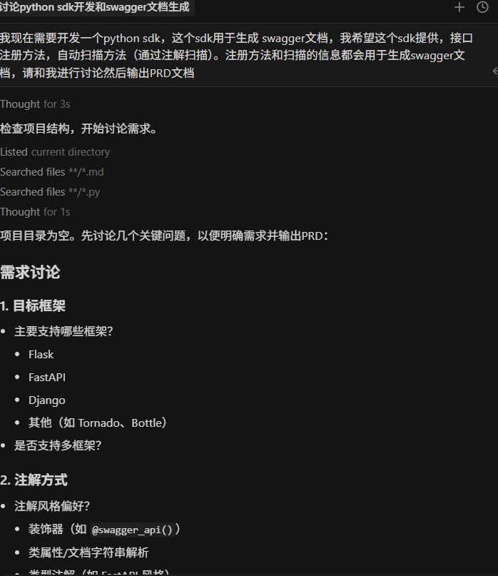
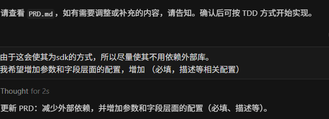
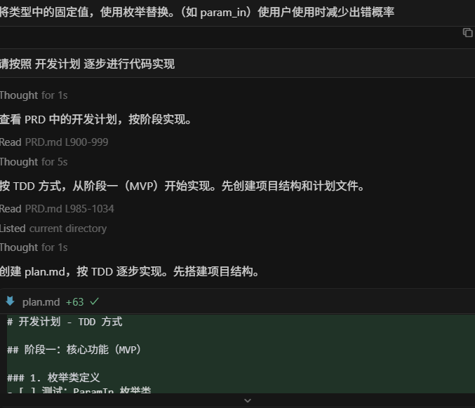
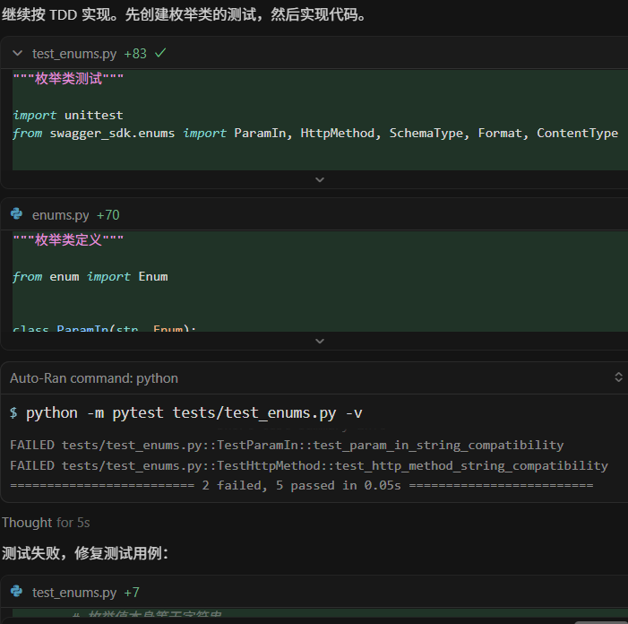
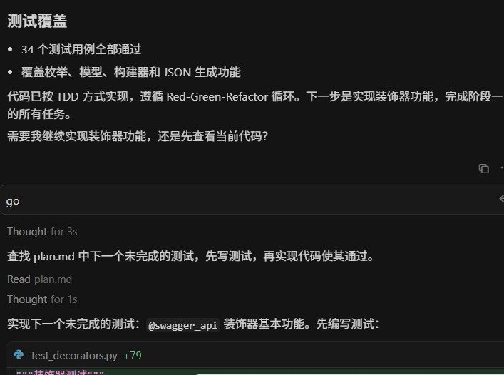
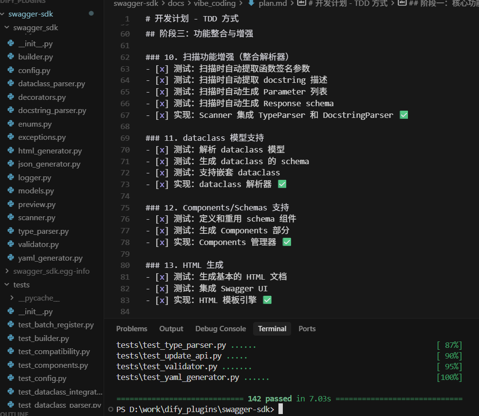
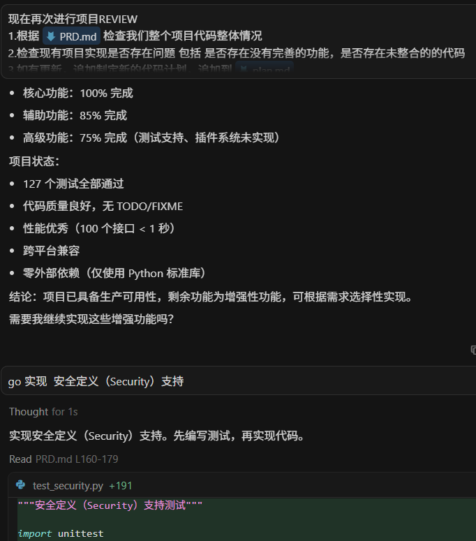

# 和 AI TDD结对编程：1天开发一个完整的 Python 库

### 故事的开始

我最近在做一个基于dify的AI workflow项目，需要把很多业务接口/agent作为工具接入到一个系统中。经过分析，最简单的方式是用 Swagger 文档来描述这些接口，动态引入到dify中这样最简单。但问题来了：**我需要一个能自动生成 Swagger 文档的工具**，而且要足够灵活、不依赖太多外部库。

于是我想：能不能让 AI 助手帮我写一个？但是，直接让 AI 写代码有个问题——**你怎么知道 AI 写的代码是对的？**&#x4F5C;为一个工具项目代码质量还是要高点，万一它"一本正经地胡说八道"怎么办？

这时候我想到了一个方法：**TDD（测试驱动开发）**。简单来说，就是"先考试，再答题"。我先告诉 AI："你写的代码必须通过这个测试"，然后让 AI 去写代码。如果测试通过了，说明代码是对的；如果没通过，AI 就得继续改。

**最终成果**：

* ⏱️ **1 天时间**，完成一个 2000+ 行的完整 Python 库
* ✅ **142 个自动化测试**，每个功能都有验证
* 🐛 **零已知 Bug**，因为所有问题都在开发时被测试发现了
* 📦 **零外部依赖**，只用 Python 自带的包

这篇文章将告诉你：**如何和 AI 结对编程，让 AI 成为你的靠谱队友，而不是不可控的代码生成器。**

> 💡 **写给编程新手**：如果你是编程小白，不用担心看不懂。这篇文章会用生活化的比喻，带你了解"和 AI 一起写代码"是什么体验。文末有完整的聊天记录，你可以看到我和 AI 的全部对话过程。

### 核心理念：用"考试"来驯服 AI

经常看开源框架的源码同学都知道，开源框架的test代码特别多，基本上一个源码文件就有一个对应的测试文件。这说明TDD在保证代码质量上效果显著。

#### 什么是 TDD？用做菜来理解

想象你要教一个从没下过厨的人做菜。有两种方法：

**传统方法**：

1. 你："去做个番茄炒蛋"
2. 对方去做了
3. 你尝一口："诶，盐放太多了，而且蛋没炒熟"
4. 重做...

**TDD 方法**（先定标准，再做菜）：

1. 你："做个番茄炒蛋，标准是：蛋要全熟、盐要刚好、番茄要软烂"
2. 对方做完后，按照标准检查
3. 如果不符合标准，立刻改进
4. 直到通过所有标准

**和 AI 编程也是一样的道理**：

* 🔴 **Red（出题）**：我先写一个"考试题"（测试代码），这个题目描述了功能应该怎么运行
* 🟢 **Green（答题）**：让 AI 写代码，直到通过考试
* 🔵 **Refactor（改善）**：代码虽然能用，但可能写得不够优雅，这时候优化一下

**关键点**：AI 写的每一行代码，都必须通过我设定的"考试"。这样就不怕 AI "胡说八道"了。

#### 我和 AI 的分工：谁负责什么？

在这个项目中，我和 AI 的分工很明确：

**我的工作（人类做决策）**：

1. 📋 **规划功能**：决定要实现什么功能，先实现哪个后实现哪个
2. ✍️ **写测试（可以用AI写）**：定义"考试题"，告诉 AI 代码应该做到什么
3. ✅ **验证结果**：运行测试，检查 AI 写的代码是否通过
4. 🔄 **反馈改进**：如果测试失败，告诉 AI 哪里不对，让它改

**AI 的工作（AI 做执行）**：

1. 💻 **写代码**：根据测试要求，生成具体的代码实现
2. 🐛 **修复错误**：测试失败时，根据错误信息修改代码
3. 🎨 **优化代码**：在测试通过后，把代码写得更漂亮
4. 📝 **生成文档**：根据代码自动生成使用说明

**举个例子**：

```
我（写测试）：
"AI，我需要一个功能，能把参数位置转换成字符串。
比如输入'查询参数'，应该输出'query'。你写的代码要通过这个测试。"

AI（写代码）：
"好的，我写了代码，运行测试看看..."

测试结果：✅ 通过！

我：
"很好，继续下一个功能..."
```

这样的好处是：**我不用关心具体怎么写代码，AI 不用担心写错了，因为测试会告诉它对不对。**

### 实战过程：我和 AI 如何配合开发

#### 第一步：和AI讨论需求输出需求文档（PRD）

**早上 - 讨论阶段**

我先向AI说出我的用户故事，列出需要实现的功能。然后从最简单的开始：

**我对 AI 说**：

```tex
我现在需要开发一个python sdk，这个sdk用于生成 swagger文档，我希望这个sdk提供，接口注册方法，自动扫描方法（通过注解扫描）。注册方法和扫描的信息都会用于生成swagger文档，请和我进行讨论然后输出PRD文档
```



上面有个提示词比较关键 `请和我进行讨论` 这样会保证AI不会一上来就直接输出内容，而是先和你确认你的详细需求，防止你遗漏重要的细节。

**AI 的回应**：

从上面图中可以看出，AI会询问你一些开发这个SDK需要明确的问题。

\*\*我对 AI 说: \*\*

然后我对上面AI给的一些问题一一进行了确认，这时候AI就比较了解你的真实需求了

**AI 的回应**：

AI回应了第一版PRD文档

然后我在检查输出PRD文档是否完全符合我的要求。如果有不符合要求的继续和AI沟通修改

\*\*我对 AI 说: \*\*

```
由于这会使其为sdk的方式，所以尽量使其不用依赖外部库。
我希望增加参数和字段层面的配置，增加 （必填，描述等相关配置）
```



**AI 继续修改：**

**关键点**：这个过程中，我们需要不断和AI沟通需求，这里我进行了3轮（由于这个sdk项目不复杂，所以讨论轮数比较少，业务复杂可能需要20-30轮），直到AI完全理解我们的需求输出完整正确的PRD文档。

#### 第二步：AI 进行TDD编程

从现在开始我们就正式进入到TDD编程环节了。

这里我准备了一份[TDD的提示词](https://github.com/AndsGo/swagger-sdk/blob/main/docs/vibe_coding/.cursor/TTD.md)，方便大家直接使用，大家可以根据直接使用的编程工具添加到对应的rules中或者agent中。

准备好了我们就可以开始了。

\*\*我对 AI 说: \*\*

```
请按照 开发计划 逐步进行代码实现
```

这里一般来说应该先让AI生成plan.md让我们确认，确认后再让AI根据plan逐步实现。于我的rules里面有这些设置，且prd文档我确认没有问题，所以就两步并成一步了。



\*\*AI开始编码 \*\*

由于我们配置了 rules所以 AI根据我设置的规则自动进行TDD工作流，AI根据PRD文档输出了开发计划 plan.md。

输出plan.md后我们需要检查计划是否合理，如果不符合我们的要求我需要让AI进行相应的调整。

确定没有问题后，AI会按plan.md进行 `测试用例`->`实现代码`->`运行测试用例`->`修复代码`的流程。



AI完成一个阶段任务后会输出一个测试用例都通过的代码，我们需要检查代码是否符合我们的预期。

**我对 AI 说:**

如果符合预期我们就直接让AI继续即可

```
go 继续实现
```



**关键点**：这个过程中，我们需要做好代码监工的工作，保证AI输出的`测试代码`和`代码`符合我们的预期。当然苦力活全身AI干😀

#### 第三步：完善和优化

完成了第二步的所有plan，不出意外我们的SDK已经完成了。



这是时候我们可以看看整体代码是否符合我们的预期，生成的测试数据是否正确。如果还有什么需要优化也可以继续，在这里

**我对 AI 说**：

```
现在进行项目REVIEW
1.根据 @PRD.md 检查我们整个项目代码整体情况
2.检查现有项目实现是否存在问题 包括 是否存在没有完善的功能，是否存在未整合的的代码
3.如有更新，追加制定新的代码计划，追加到 @plan.md 
```

这里我让AI检查我们的项目是否符合我的RPD要求，AI会给出项目目前完成情况，并给出建议，并将需要优化的地方追加到计划中。我们可以根据我们的需要让AI指定完成对应的plan。

**AI输出对应优化计划：**



**我对AI说:**

我们需要检查plan情况，如果有修改可以和AI沟通进行修改。这里我看计划没啥问题，我就直接让AI实现了：

```
go 实现 安全定义（Security）支持。
```

沟通完后AI会完善对应的代码，当上面完成后我们可以让AI给我们的项目生成详细的文档，方便我们去使用

**我对AI说:**

```
压缩上下文，然后完成计划中的 文档完善
```


AI会生成一个很完善的README.md，根据文档无论是我们自己还是其他人都可以快速进行使用了。

下面就是README.md 测试的页面。


***

#### 统计数据

| 时间  | 累计测试数 | 通过率  | 发现 Bug 数 | 关键里程碑     |
| --- | ----- | ---- | -------- | --------- |
| 2小时 | 0     | 100% | 0        | 完成PRD文档编写 |
| 3小时 | 85    | 100% | 3        | 智能解析完成    |
| 2小时 | 142   | 100% | 3        | 项目完成！     |

**总结**：1 天时间，发现并修复了 7 个 Bug（都在开发阶段就被测试发现了），没有遗留任何已知问题。

#### 我学到的关键经验

**1. 测试是和 AI 沟通的"共同语言"**

**错误的方式**（说人话）：

* 我："帮我写个函数，能解析复杂的类型注解"
* AI：生成 200 行代码（可能有 bug）
* 我：不知道对不对，得慢慢测试...

**正确的方式**（用测试说话）：

* 我：给一个需求，展示输入和期望的输出
* AI：看懂理解输入输出，写测试用例，写代码
* 测试结果：立刻知道对不对！

**比喻**：测试就像是给 AI 一道数学题，题目写得越清楚，AI 越容易给出正确答案。

**2. 小步快跑，每一步都要验证**

**我的节奏**：

1. 让AI根据任务编写小测试，我再我要求调整测试用例（5 分钟）
2. 让 AI 实现代码（2 分钟）
3. 运行测试（10 秒）
4. 通过了就继续，没通过就让 AI 改
5. 重复...

**为什么不一次性写很多功能**？因为万一错了，很难找到问题在哪里。小步走，随时能回头。

**比喻**：就像搭积木，搭一层就要看看稳不稳，而不是搭完一整栋再检查。

**3. AI 会犯错，但测试会告诉它**

在这个项目中，AI 一共犯了 7 次错误：

* 类型定义不对（1 次）
* 数据格式转换错误（2 次）
* 边界情况没考虑（3 次）
* 逻辑判断错误（1 次）

**关键是**：每次错误都被测试立刻发现了！如果没有测试，这些 bug 可能要等到用户使用时才会发现。

**比喻**：测试就像是"考试"，AI 做错了题，立刻就能看到哪里错了。

### TDD案例：AI 是怎么解决问题的

#### 案例 1：当 AI"理解错"了需求

**场景**：我需要一个功能，能判断一个字段是"必填"还是"可选"。

**我写的测试**：

```python
def test_required_field():
    # 一个没有默认值的字段，应该是必填的
    field = Field(name="id", type="integer")
    assert field.is_required == True  # 应该是必填
```

**AI 第一次写的代码**：

```python
is_required = (field.default is None)  # ❌ 逻辑错误
```

**测试结果**：失败！❌

**我对 AI 说**： "测试失败了。问题是：没有设置默认值（None）不代表是必填的，要检查是否明确标记为'MISSING'（缺失）。"

**AI 修改后**：

```python
is_required = (field.default == MISSING)  # ✅ 正确
```

**测试结果**：通过！✅

**启示**：AI 第一次可能理解错，但测试会立刻暴露问题。你不需要懂怎么写代码，只要能看懂错误信息就行。

#### 案例 2：AI 帮我优化了代码

**场景**：有个功能需要把数据转成 YAML 格式，我本来想用现成的库。

**我对 AI 说**： "我希望不依赖外部库。你能不能自己实现一个简单的 YAML 生成器？"

**我的顾虑**：YAML 格式复杂，AI 能做好吗？

**测试用例**：

```python
def test_simple_yaml():
    data = {"name": "test", "version": "1.0"}
    result = to_yaml(data)
    assert "name: test" in result
    assert "version: 1.0" in result
```

**AI 的回应**： "我可以实现。让我写个递归函数，处理字典、列表、字符串..."

**结果**：AI 用 40 行代码实现了！而且 4 个测试全部通过！✅

**启示**：有时候 AI 的能力超出你的想象。通过测试，你可以放心让 AI 尝试。

#### 案例 3：边界情况的发现

**场景**：处理用户输入时，可能有空值、特殊字符等边界情况。

**最初的测试**（只测试正常情况）：

```python
def test_normal_input():
    result = process("hello")
    assert result == "hello"
```

**AI 写了代码，测试通过了**。

**但我想了想**：如果输入是空字符串呢？如果有特殊字符呢？

**我补充了测试**：

```python
def test_empty_input():
    result = process("")
    assert result == ""  # 空字符串应该正常处理

def test_special_chars():
    result = process("hello\nworld")
    assert "\\n" in result  # 换行符应该被转义
```

**新测试运行**：失败！❌

**AI 看到测试后**： "我理解了，需要处理边界情况。让我修改代码..."

**修改后**：全部通过！✅

**启示**：通过补充测试，可以让 AI 考虑到你担心的所有情况。

### 给编程新手的建议

#### Q1: 我不会写代码，也能用这种方法吗？

**答**：可以！但你需要学会两件事：

1. **学会写简单的测试**（比写功能代码简单多了）
   * 测试就是"描述你想要什么"
   * 不需要知道怎么实现，只需要知道输入和期望的输出
2. **学会看懂错误信息**
   * 测试失败时，会告诉你哪里不对
   * 把错误信息告诉 AI，AI 就知道怎么改

**举例**：

```python
# 这个测试连初学者都能看懂：
def test_add():
    result = add(2, 3)  # 把 2 和 3 相加
    assert result == 5  # 结果应该是 5
```

你告诉 AI："让这个测试通过"，AI 就会写一个 `add` 函数。

#### Q2: 写测试不是更浪费时间吗？

**答**：短期看是多花了时间，长期看反而节省时间。其实测试用例也可以用AI来写，人来复核。

**时间对比**（我实际使用的体感数据）：

**不写测试**：

* Day 1: AI 写代码 6 小时
* Day 2: 发现 bug，调试 4 小时
* Day 3: 改一个功能，又出新 bug，调试 3 小时
* **总计：13 小时**，还可能有隐藏的 bug

**写测试（TDD）**：

* Day 1: 写测试 2 小时，AI 写代码 4 小时
* Day 2: 写测试 2 小时，AI 写代码 3 小时
* Day 3: 写测试 1 小时，AI 写代码 2 小时
* **总计：14 小时**，但没有已知 bug！

而且，如果以后要修改功能，有测试的项目改起来快多了（因为改完立刻知道有没有弄坏别的功能）。

#### Q3: 为什么要和 AI 结对编程？我直接让 AI 全写不行吗？

**答**：可以，但风险很大。如果最终没有生成好那就是“屎山代码”了，而且还费token。对于复杂项目建议还是建议根据plan，用TDD一步一步来，有时候慢点反而快（而且你都用AI生成代码了怎么都是效率起飞）。 现在的AI可以一步到位干到80分可以，但是要干到95，100分就要人去监督了，TDD就是人监督AI的一种方式。

**让 AI 全写的问题**：

1. ❌ AI 可能理解错你的需求
2. ❌ AI 写的代码你看不懂，不敢用
3. ❌ 出了 bug 不知道哪里错了
4. ❌ 以后要改功能，不敢动代码（怕改坏了）

**和 AI 结对编程（用 TDD）**：

1. ✅ 测试保证 AI 理解了需求
2. ✅ 测试就是文档，看测试就知道代码做什么
3. ✅ 出了 bug，测试会告诉你在哪里
4. ✅ 改功能后运行测试，立刻知道有没有改坏

**比喻**：AI 是个很能干的员工，但需要你来验收工作成果。测试就是验收标准。

#### Q4: 我该用什么工具？

**最小化工具集**（适合新手）：

* **代码编辑器**：Cursor 或 Trae(免费)
* **编程语言**：Python（最适合新手）
* **测试工具**：`pytest`（运行命令：`pytest tests/`）
* **版本控制**：Git（方便随时回退）

**我的工作环境**：

* Cursor/trae 编辑器
* Python 3.11
* pytest 测试框架
* Git 版本管理

**花费**：除了 Cursor 的订阅费（$20/月）(免费可以用 trae\_CN 代替)，其他全免费。

### 总结：TDD 让 AI 成为靠谱队友

#### 核心收获

通过这个 1 天的项目，我验证了一个观点：**在 AI 时代，测试不是负担，而是让 AI 为你工作的"指挥棒"**。

**数据说话**：

* 📊 **142 个测试**，每个功能都有验证
* ⏱️ **1 天完成**，包括测试编写和代码实现
* 🐛 **0 个已知 bug**，所有问题都在开发时被测试拦住了
* 🚀 **3-5 倍效率**，相比传统开发方式

**为什么 TDD + AI 输出的代码质量高？**

1. **测试是给 AI 的"作业题"**
   * 你不用解释需求，写个测试就行
   * AI 看懂测试，自己写代码
   * 测试通过 = 功能正确
2. **AI 会犯错，但测试会兜底**
   * 这个项目中 AI 犯了 7 次错
   * 但每次都被测试立刻发现了
   * 没有任何 bug 流到最终产品
3. **小步快跑，风险可控**
   * 每个功能独立测试
   * 出问题立刻知道是哪里
   * 改起来快，不怕弄坏其他功能

#### 给你的行动建议

**如果你是编程新手**：

1. ✅ 学会编写PRD文档
2. ✅ 学习写简单的测试（比学写复杂代码容易多了）。当然也可以让AI编写，但是你需要保证你自己能够看到。
3. ✅ 用 Cursor 或类似的 AI 工具
4. ✅ 从小项目开始尝试（比如做个计算器）
5. ✅ 体会"测试先行"的安全感

**如果你是有经验的开发者**：

1. ✅ 尝试在下一个功能中应用 TDD
2. ✅ 用测试来"驾驭" AI，而不是直接让 AI 写代码
3. ✅ 建立自己的测试规范和 AI 协作流程
4. ✅ 分享你的经验，帮助更多人

#### 最后想说的话

AI 很强大，但也会犯错。TDD 不是为了限制 AI，而是为了**让你放心地使用 AI 的能力**。

就像开车一样：

* AI 是强大的引擎（跑得快）
* TDD 是安全带和刹车（保证安全）
* 你是驾驶员（掌握方向）

**三者结合，才能又快又稳地到达目的地。**

这个项目花了我 1 天时间，完成了一个 2000 多行的完整库。如果用传统方式开发，我估计至少要 1 周。而且，TDD 版本的代码质量更高、更好维护。

如果你也想尝试这种开发方式，欢迎查看项目源码和完整的开发记录。相信我，一旦你体验过"有测试保护的 AI 协作"，就再也回不去了。

***

### 附录：完整开发记录

想看我和 AI 的完整对话过程吗？我把 1 天的开发聊天记录都保存了下来：

📄 [**查看完整的 Vibe Coding 聊天记录**](https://github.com/AndsGo/swagger-sdk/blob/main/docs/vibe_coding/cursor_python_sdk_swagger.md)

记录包括：

* 需求分析和PRD文档编写
* AI 是怎么理解和实现的
* 遇到问题时我和 AI 如何调试
* 142 个测试的完整演进过程

**项目地址**：

* 🔗 `swagger_sdk`：[GitHub 链接](https://github.com/AndsGo/swagger-sdk)
* 🔗 `TDD规则`：[GitHub 链接](https://github.com/AndsGo/swagger-sdk/blob/main/docs/vibe_coding/.cursor/TTD.md)
* 🔗 查看完整的 Vibe Coding 聊天记录 (你需要搜索**User**定位到用户输出)\`：[GitHub 链接](https://github.com/AndsGo/swagger-sdk/blob/main/docs/vibe_coding/cursor_python_sdk_swagger.md)
